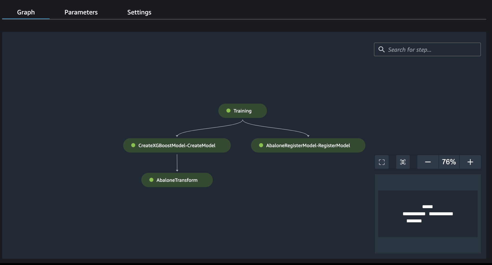

## Pipeline with Train, Register, and Batch Inference
This MLOPs Pipeline shows how to take an XGBoost algorithm for Training, Model Registry, and Batch Inference.

## DAG/WorkFlow

## [Blog](https://medium.com/aws-in-plain-english/deploy-an-mlops-pipeline-with-training-model-registry-and-batch-inference-377a3707607c)
